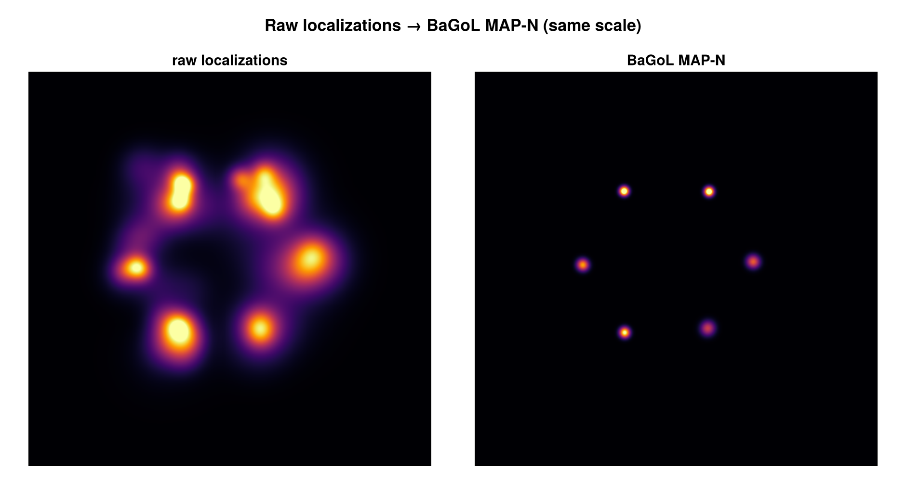

```@meta
CurrentModule = SMLMBaGoL
```

# SMLMBaGoL.jl

SMLMBaGoL performs **Bayesian Grouping of Localizations (BaGoL)** on single-molecule
localization microscopy (SMLM) data. A single fluorophore blinks many times during an
acquisition, scattering its signal across many localizations; BaGoL groups those
localizations back into the individual emitters that produced them, yielding emitter
positions at precision beyond that of the raw localizations. It operates on the
`SMLMData.SMLD` structures used across the [JuliaSMLM](https://github.com/JuliaSMLM)
ecosystem.

This package is a Julia reimplementation of the BaGoL algorithm of Fazel *et al.*
(*Nature Communications* **13**, 7152, 2022).

## How it works

In an SMLM experiment a single fluorescent emitter blinks repeatedly, so it appears not
as one point but as a scatter of localizations spread around its true location. BaGoL
treats such localizations as measurements from a mixture of emitters whose number and
true positions are both unknown. Given the localizations and their reported
uncertainties, it asks: which arrangements of emitters could plausibly have produced
this data, and how probable is each? To answer, it runs an MCMC sampler whose
reversible-jump (RJMCMC) moves split, merge, create, and remove emitters, exploring
models with different emitter counts as it goes.

Rather than committing to a single grouping, BaGoL builds a full posterior probability
distribution over *both* the number of emitters and their positions: the probability of
each possible emitter count, a super-resolved posterior image, and a position covariance
for each grouped emitter. For downstream analysis we usually summarize this posterior
with the **MAP-N** estimate — the most probable number of emitters, together with a
representative grouping of localizations at that count — which pools the localizations
assigned to each emitter to reach a position more precise than any single localization.

BaGoL makes two assumptions about the localizations. First, that each localization is a real
observation of a single emitter; it follows that any spurious or multi-emitter fits from the
upstream analysis pipeline — where one localization stands for two or more emitters — must be
removed by preprocessing before BaGoL. Second, that the reported localization precision `σ` is
correct. This second assumption can be relaxed: where `σ` carries a uniform excess error,
[`estimate_se_adjust`](@ref) estimates it from the data, and `se_adjust=:auto` folds the excess
`τ` into each localization in quadrature (`σ² + τ²`) before grouping. The
[Mathematics](math/index.md) section describes the statistics in full.



*A simulated hexamer: the raw localizations (left) are an unresolved blur; the BaGoL MAP-N
result (right) recovers the six individual emitters at the same scale.*

## Installation

```julia
using Pkg
Pkg.add("SMLMBaGoL")
```

## Quick Start

```julia
using SMLMBaGoL
using SMLMData

# Group localizations into emitters — returns (BasicSMLD, BaGoLDiagnostics)
result_smld, diagnostics = run_bagol(smld)

# Grouped emitter positions (Emitter2DFit, with posterior uncertainties)
result_smld.emitters

# Posterior summary
diagnostics.n_emitters    # MAP-N number of emitters
diagnostics.posterior_k   # emitter-count histogram over the chain (normalize for P(K))
```

[`run_bagol`](@ref) also accepts a `Vector` of localizations directly, given a camera:

```julia
result_smld, diagnostics = run_bagol(locs; camera=camera)
```

## Where to go next

- **Run it now** → the [User Guide](guide.md): inputs and units, the `run_bagol` options,
  what comes back and how to tell a run is sane, standard reports, and large-dataset
  partitioning.
- **Understand the model** → the [Mathematics](math/index.md) section: a code-grounded
  breakdown of the collapsed RJMCMC sampler, the priors, MAP-N estimation, and uncertainty
  correction — split across pages by concept, with figures.
- **See results** → the [Results Gallery](results.md): end-to-end runs on simulated data.
- **Go low-level** → the [API Reference](api.md): every exported type and function, with the
  diagnostics and validation tools grouped separately.

## Citation

If you use SMLMBaGoL in your research, please cite:

> Fazel, M. *et al.* High-Precision Estimation of Emitter Positions using Bayesian
> Grouping of Localizations. *Nature Communications* **13**, 7152 (2022).
> <https://doi.org/10.1038/s41467-022-34894-2>
