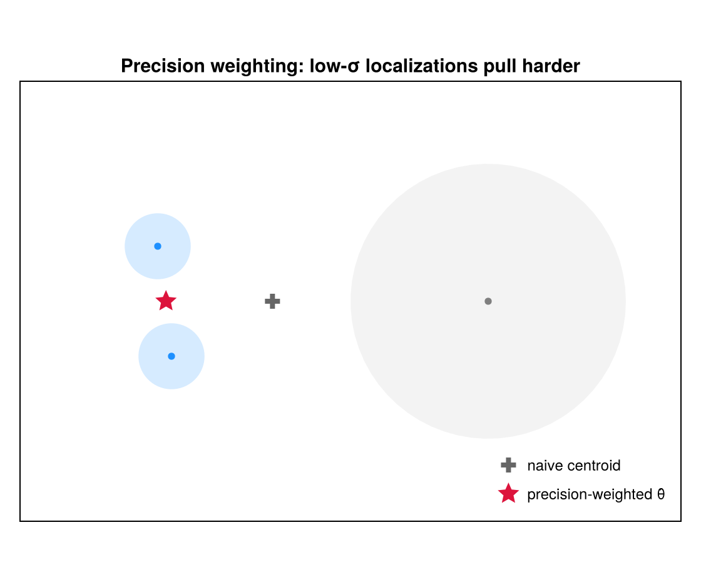
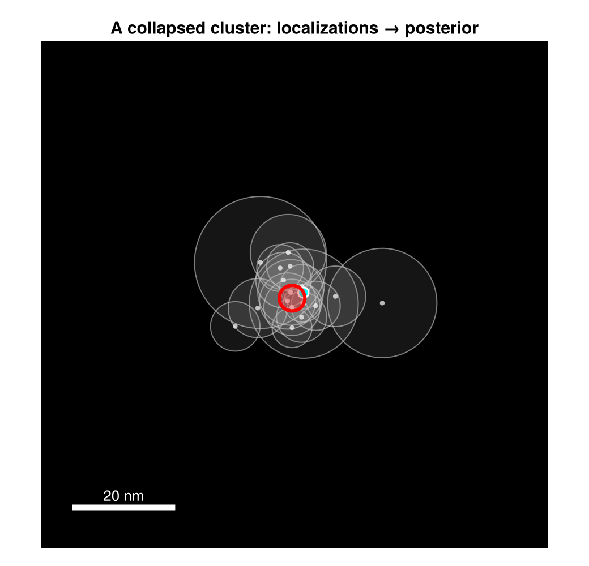

```@meta
CurrentModule = SMLMBaGoL
```

# Collapsed Representation

A BaGoL **grouping** is an *allocation*: an assignment of every localization to an emitter,
written as the vector ``\mathbf{z}`` (where ``z_i = k`` means localization ``i`` came from
emitter ``k``). That allocation is what BaGoL infers; it then summarizes the result as the
MAP-N emitters, with their positions and uncertainties. The grouping *is* the allocation.

"**Collapsed**" describes how the sampler represents that grouping. Each emitter's position
``\boldsymbol{\theta}_k`` is integrated out analytically — never sampled — so the sampler's
grouping state is the discrete allocation ``(K, \mathbf{z})`` rather than any continuous
positions; the model has been *collapsed* to a discrete grouping by integrating out the
positions. This keeps the moves cheap and the acceptance ratios free of Jacobian terms. (The
positions are recovered analytically at the end, for reporting — see [Posterior position of a
cluster](#Posterior-position-of-a-cluster) below.)

## Sufficient statistics

A cluster is summarized by additive sufficient statistics (the [`ClusterStats`](@ref) type,
`cluster_stats.jl`). With ``\Lambda_i = \Sigma_i^{-1}`` the precision of localization ``i``:

```math
\Lambda = \sum_{i \in c} \Lambda_i, \quad
\boldsymbol{\eta} = \sum_{i \in c} \Lambda_i \mathbf{x}_i, \quad
\mathrm{quad} = \sum_{i \in c} \mathbf{x}_i^\top \Lambda_i \mathbf{x}_i, \quad
\sum_{i \in c} \log\det\Sigma_i, \quad
n = |c|.
```

The localization uncertainty ``\sigma`` enters the model **only through these statistics** —
as precision ``\Lambda_i`` and through the per-localization log-determinant
``\log\det\Sigma_i`` (the Gaussian normalization). For a 2D localization with reported
``\sigma_x, \sigma_y`` and covariance ``\sigma_{xy}``,

```math
\Sigma_i = \begin{pmatrix} \sigma_x^2 & \sigma_{xy} \\ \sigma_{xy} & \sigma_y^2 \end{pmatrix},
\qquad
\Lambda_i = \Sigma_i^{-1} = \frac{1}{\det\Sigma_i}
\begin{pmatrix} \sigma_y^2 & -\sigma_{xy} \\ -\sigma_{xy} & \sigma_x^2 \end{pmatrix},
```

reducing to ``\Lambda_i = \mathrm{diag}(1/\sigma_x^2,\ 1/\sigma_y^2)`` in the diagonal case.
Because the statistics are sums, adding and removing a localization are exact ``O(1)``
inverses (`add_loc` / `remove_loc`) — the operations the Gibbs sweep performs millions of
times.



*Two low-σ localizations (small blue discs) and one high-σ localization (large gray disc).
The precision-weighted mean ``\hat{\boldsymbol\theta}`` (red star) sits near the confident
pair, not at the naive centroid (gray cross). Larger ``\Sigma_i`` ⇒ smaller pull.*

## Posterior position of a cluster

Under a flat prior on ``\boldsymbol{\theta}``, the position posterior is Gaussian with a
precision-weighted-centroid mean and inverse-total-precision covariance
([`ClusterStats`](@ref) `posterior_mean` / `posterior_cov`):

```math
\hat{\boldsymbol{\theta}} = \Lambda^{-1}\boldsymbol{\eta}
   = \Big(\textstyle\sum_i \Lambda_i\Big)^{-1}\Big(\sum_i \Lambda_i \mathbf{x}_i\Big),
\qquad
\widehat{\mathrm{Cov}}(\boldsymbol{\theta}) = \Lambda^{-1}
   = \Big(\textstyle\sum_i \Sigma_i^{-1}\Big)^{-1}.
```

The covariance is the inverse of the **summed** precision, so pooling ``n`` localizations of
comparable quality shrinks the position uncertainty by roughly ``\sqrt{n}`` — the
super-resolution gain made precise. These two quantities are exactly what the MAP-N output
emitters carry as their position and reported uncertainty.

!!! note "Spatial model vs. reported uncertainty"
    This posterior mean and covariance — the reported emitter position and its uncertainty —
    come from the flat-prior Gaussian combination and are the **same for both spatial
    models**. Choosing `:locmix` vs `:flat` changes only the *marginal-likelihood score* that
    compares groupings ([next page](marginal.md)), not the reported emitter uncertainty.



*One emitter's localizations (faint gray 1σ discs) collapse to a tight posterior (red 2σ
ellipse) sitting on the true position (cyan) — far tighter than any single localization's
uncertainty.*

## Why collapse?

Integrating ``\boldsymbol{\theta}`` out yields the cluster's **marginal likelihood**, the
quantity every move scores against. Because the state is purely discrete, every transition
is a re-partitioning of localizations, and the acceptance ratio is a ratio of marginal
likelihoods and prior factors — no continuous-parameter proposal, no Jacobian. The next
page derives that marginal likelihood for both spatial models.

!!! note "General method: collapsing (Rao–Blackwellization)"
    Whenever some parameters can be integrated out *exactly*, it is usually worth doing:
    sampling fewer, lower-variance quantities makes MCMC both faster and less noisy — a
    standard method called **Rao–Blackwellization**. Here the emitter positions
    ``\boldsymbol{\theta}_k`` are nuisance parameters *for the grouping search* — recovered
    analytically as the reported positions once the grouping is fixed. Gaussian conjugacy lets
    us replace "sample each position, then score" with a closed-form Gaussian marginal per
    cluster, so the chain explores only the discrete groupings. The same idea underlies the Rao-Blackwellized posterior
    image, which blurs each cluster by its *posterior* covariance instead of plotting point
    estimates.
