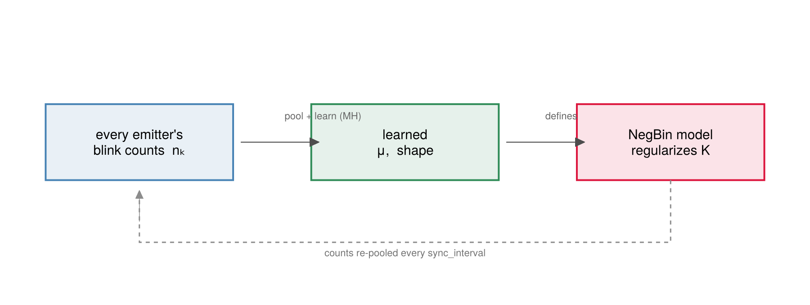
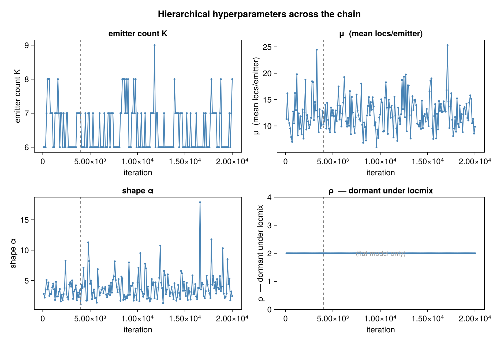
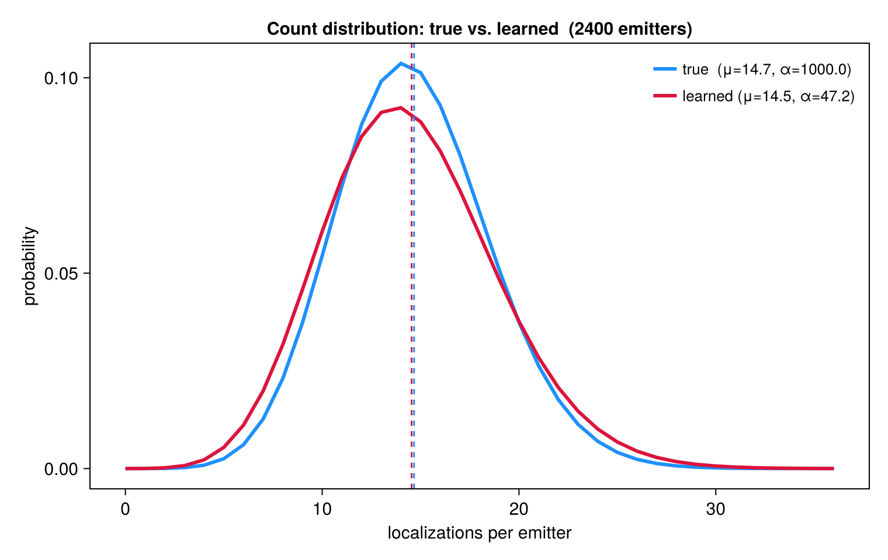

```@meta
CurrentModule = SMLMBaGoL
```

# Hierarchical Learning

BaGoL does not ask you to know your sample's blinking statistics in advance. The number of
localizations a single emitter produces is modelled as a [negative
binomial](priors.md#Count:-the-negative-binomial-blink-model) whose mean ``\mu`` and shape
``\alpha`` are *themselves* unknown — a **hierarchical** prior. Rather than fix these
hyperparameters, the sampler puts Gamma hyperpriors on them and learns them jointly with the
grouping, pooling information across every emitter in the field. The count model that
regularizes the emitter number ``K`` therefore adapts to the data: a sparsely-blinking
dSTORM dataset and a densely-blinking DNA-PAINT dataset are fit with different learned
``(\mu, \alpha)`` from the same code, with no manual tuning.

Concretely, the count hyperparameters ``\mu`` and ``\alpha`` are not fixed by default — they
are updated from the data on a fixed cadence (default every 100 iterations: `sync_interval`
in [`run_bagol`](@ref), `hierarchical_interval` in [`run_collapsed_chain`](@ref)), gated by
`learn_distribution` (`hierarchical.jl`). The Poisson-K emitter density ``\rho``, when that
prior is active, is controlled independently by `learn_rho`; a fully fixed hyperparameter run
sets both `learn_distribution=false` and `learn_rho=false`.

!!! note "General method: hierarchical Bayes"
    Fixing ``\mu`` and ``\alpha`` to guessed values would bake an assumption about your
    sample's blinking into the result. Instead BaGoL treats them as **shared parameters** of a
    *hierarchical* model: every emitter's blink count is drawn from one common count
    distribution, and that distribution's parameters get their own (hyper)priors and are
    inferred from the data. Because all emitters inform the same ``(\mu, \alpha)``, the
    estimate **pools information across the whole field** — many emitters with only a few
    blinks each still pin the distribution down ("borrowing strength"). Learning shared
    hyperparameters this way is a standard hierarchical-Bayes technique used beyond SMLM
    (in full-Bayes form here — the hyperparameters are *sampled*, not fixed to a point estimate
    as in empirical Bayes); it means you need not know the blinking kinetics in advance.
    **In your output:** `final_μ` / `final_shape` are the final learned (last-sampled) values,
    and the `convergence_trace` shows them settling.



*The count distribution's parameters are learned from every emitter's blink counts and feed
straight back into the NegBin model that regularizes ``K`` — relearned every `sync_interval`
iterations.*

## ``\mu`` and shape ``\alpha`` — Metropolis–Hastings

Both are updated by a **log-normal random-walk Metropolis–Hastings** step against the
per-cluster negative-binomial likelihood and a Gamma prior. For ``\mu`` (shape ``\alpha`` is
analogous, with both NegBin parameters depending on it):

```math
\mu' = \mu\, e^{s\xi},\ \xi \sim \mathcal{N}(0,1), \qquad
\log\alpha_{\text{acc}} = \big[\log\mathcal{L}(\mu') - \log\mathcal{L}(\mu)\big]
   + \big[\log p(\mu') - \log p(\mu)\big] + \underbrace{(\log\mu' - \log\mu)}_{\text{Jacobian}},
```

where ``\mathcal{L}(\mu) = \prod_{k}\mathrm{NegBin}(n_k;\ \alpha,\ \alpha/(\alpha+\mu))`` over
active clusters, and the multiplicative walk contributes the log-Jacobian
``\log\mu' - \log\mu``. The priors are ``\mu \sim \mathrm{Gamma}(2, 5)`` (mean 10) and
``\alpha \sim \mathrm{Gamma}(2, 1)`` (mean 2); proposals are bounded to ``[1, 500]`` and
``[0.5, 50]`` respectively.

Two regimes exist:

- **Partitioned [`run_bagol`](@ref) path** — an **``N``-step (50) adaptive** kernel that pools
  counts across all partitions (excluding clusters that contain overlap localizations) and
  tunes the step size ``s`` by a Robbins–Monro rule toward ≈ 0.30 acceptance **during
  burn-in**; the step size is then frozen, preserving ergodicity.
- **Standalone [`run_collapsed_chain`](@ref)** — a single-step, fixed-scale (``s = 0.3``)
  version.



*The ``K`` / ``\mu`` / shape / ``\rho`` traces over the chain with the burn-in line, for a
field of ~2400 emitters (``K`` is the total emitter count). ``\mu`` and shape settle as the
chain learns the count distribution; ``\rho`` stays flat — it is dormant under the default
locmix model.*

## ``\rho`` — conjugate Gibbs (flat model only)

The Poisson-``K``-prior density ``\rho`` (used only under `spatial_model = :flat`) has a
conjugate Gamma posterior and is drawn exactly — no accept/reject — from

```math
\rho \mid K, A \;\sim\; \mathrm{Gamma}\big(\text{shape } a + K,\ \text{rate } b + A\big),
```

with ``\rho \sim \mathrm{Gamma}(2, 1)`` as prior. Under the default `:locmix` model there is
no Poisson ``K`` prior, so this step does not run; ``\rho`` stays at its prior mean.

## How learning closes the loop

Learned ``\mu`` and ``\alpha`` feed straight back into the [count model](priors.md#Count:-the-negative-binomial-blink-model)
that scores every ``K``-changing [move](moves.md): a larger learned ``\mu`` (more
localizations per emitter) lowers the count-model penalty for *fewer*, larger clusters, and
vice versa. The convergence trace above is the direct readout of this feedback.



*The count distribution the sampler learns (red) against the true generating one (blue), with
their means (dashed), over a field of ~2400 emitters. With realistic statistics the learned
distribution tracks the true one closely.*

Once the chain has run, we still need a single point estimate from the posterior — that is
[MAP-N Estimation](mapn.md).
