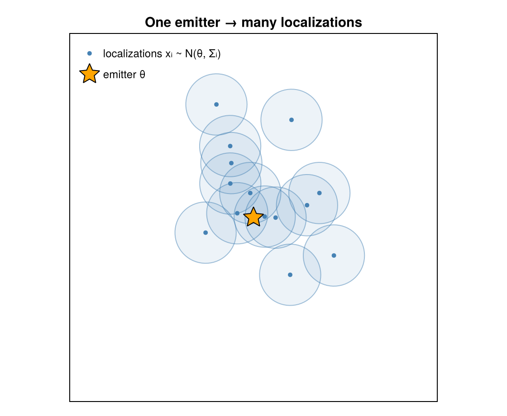

```@meta
CurrentModule = SMLMBaGoL
```

# Mathematics: Overview

This section is a detailed, code-grounded breakdown of the model and sampler. Each page
states the mathematics **as implemented in the source** and cites the file that computes
it. Read it top to bottom for the full derivation, or jump to a single concept:

- [Collapsed Representation](collapsed.md) — state = allocation; positions integrated out.
- [Spatial Models & Marginal Likelihood](marginal.md) — flat vs. locmix; the marginal.
- [Priors](priors.md) — allocation (DM), count (NegBin), and the K prior.
- [The Sampler: Moves](moves.md) — Gibbs sweep, split/merge, birth/death, acceptance.
- [Hierarchical Learning](hierarchical.md) — learning ``\mu``, shape, and ``\rho``.
- [MAP-N Estimation](mapn.md) — Dahl consensus and overlap-Hungarian pooling.
- [Large-Dataset Partitioning](partitioning.md) — precision-weighted DBSCAN, dedup.
- [Uncertainty Correction](se_adjust.md) — the ``\tau`` finder.

!!! note "Glossary — plain-English terms"
    - **localization** — one blinking event's fitted position, with its own uncertainty.
    - **emitter** — a true fluorophore; BaGoL groups many localizations into one emitter.
    - **allocation ``\mathbf{z}``** — which emitter each localization is assigned to.
    - **``K``** — the number of emitters (unknown, inferred).
    - **collapsed** — the emitter positions are integrated out analytically, so the sampler
      moves only over the discrete allocation.
    - **marginal likelihood** — the score of a cluster with its emitter position integrated out.
    - **RJMCMC** — reversible-jump MCMC; the moves that change ``K``.
    - **MAP-N** — the point summary: the most probable ``K`` plus a representative grouping.
    - **PSM** — posterior similarity matrix: how often two localizations share an emitter.
    - **DM / NegBin / locmix** — the allocation prior, the blink-count model, the spatial prior.
    - **Dahl / Hungarian / METIS** — consensus partition / optimal matching / graph partitioner.
    - **Rao-Blackwellized** — variance reduced by handling a quantity exactly instead of sampling.

## Notation

| Symbol | Meaning |
|---|---|
| ``\mathbf{x}_i \in \mathbb{R}^D`` | observed position of localization ``i`` (``D = 2`` standard) |
| ``\Sigma_i,\ \Lambda_i = \Sigma_i^{-1}`` | reported covariance and precision of localization ``i`` |
| ``z_i`` | allocation: which emitter produced localization ``i`` |
| ``K`` | number of emitters (clusters) |
| ``n_k`` | number of localizations assigned to emitter ``k`` |
| ``N = \sum_k n_k`` | total number of localizations |
| ``\boldsymbol{\theta}_k`` | position of emitter ``k`` (integrated out in the sampler) |
| ``\mu,\ \alpha`` | count-distribution mean and shape (`shape`) |
| ``\gamma`` | DM partition-prior concentration (``= \alpha`` by default) |
| ``A`` | area of the spatial region |

All positions and uncertainties are in micrometers (μm).

## The inference problem

A field of view contains ``K`` emitters at unknown positions
``\boldsymbol{\theta}_1, \dots, \boldsymbol{\theta}_K``. Each emitter ``k`` blinks a random
number of times ``n_k``, and each blink produces one localization drawn around the emitter
with its reported uncertainty. Writing ``z_i \in \{1, \dots, K\}`` for the **allocation** —
which emitter produced localization ``i`` — the generative model is

```math
K \sim \text{(count prior)}, \qquad
\boldsymbol{\theta}_k \sim \text{(spatial prior)}, \qquad
\mathbf{x}_i \mid z_i = k,\ \boldsymbol{\theta}_k \;\sim\; \mathcal{N}(\boldsymbol{\theta}_k,\ \Sigma_i).
```

Both ``K`` and the allocation ``\mathbf{z}`` are unknown, and so are the pooled positions
``\boldsymbol{\theta}_k``. BaGoL infers the joint posterior
``p(K, \mathbf{z}, \boldsymbol{\theta} \mid \mathbf{x})`` by MCMC, then summarizes it.



*A single emitter (orange star) blinks repeatedly, scattering localizations (blue points),
each with its own uncertainty disc ``\Sigma_i``. BaGoL inverts this — the cloud back to the
emitter.*

Rather than committing to one grouping, BaGoL builds a full posterior over **both** the
number of emitters and their positions, and summarizes it with the **MAP-N** estimate (the
most probable count plus a representative grouping). Pooling the localizations of each
emitter yields a position more precise than any single localization — the super-resolution
gain.


*Top: Gaussian render of the raw localizations of a simulated hexamer (a blur). Bottom: the
BaGoL MAP-N result at the same scale — six resolved emitters. Pipeline: `simulate_nmer` →
[`run_bagol`](@ref) → [`render_report`](@ref).*

## How BaGoL samples it: collapsed RJMCMC

The target posterior ``p(K, \mathbf{z}, \boldsymbol{\theta} \mid \mathbf{x})`` lives in a
space whose **dimension changes with ``K``** — every emitter adds a position
``\boldsymbol{\theta}_k``. Ordinary MCMC cannot move between models with different numbers of
parameters; **reversible-jump MCMC (RJMCMC)** can. Its dimension-changing moves — split one
cluster into two, merge two into one, give birth to a new emitter, remove an empty one —
propose a jump ``K \to K \pm 1`` and accept it with a Metropolis–Hastings ratio constructed
so the chain's stationary distribution is exactly the posterior. (The moves are detailed on
[The Sampler: Moves](moves.md).)

BaGoL adds one decisive simplification: it **never samples the continuous positions**
``\boldsymbol{\theta}_k`` at all. A collection of localizations assigned to one emitter has a
**closed-form Gaussian posterior** for that emitter's position — the conjugate product of the
localizations' own Gaussians:

```math
p\big(\boldsymbol{\theta}_k \mid \{\mathbf{x}_i : z_i = k\}\big) =
\mathcal{N}\!\big(\boldsymbol{\theta}_k;\ \hat{\boldsymbol{\theta}}_k,\ \Lambda_k^{-1}\big),
\qquad
\hat{\boldsymbol{\theta}}_k = \Lambda_k^{-1}\boldsymbol{\eta}_k, \quad
\Lambda_k = \!\!\sum_{i:\,z_i=k}\!\! \Lambda_i, \quad
\boldsymbol{\eta}_k = \!\!\sum_{i:\,z_i=k}\!\! \Lambda_i \mathbf{x}_i .
```

Because that posterior is analytic, the position can be **integrated out in closed form**,
leaving the cluster's *marginal likelihood* — the probability of that collection of
localizations with the emitter position already accounted for. The sampler therefore carries
a **collapsed** state: only the discrete allocation ``(K, \mathbf{z})``, scored by a product
of analytic cluster marginals. This is the **collapsed Gibbs** sampler, and it buys two
things:

- **Better mixing, lower variance** — the high-variance continuous positions are handled
  *exactly* instead of being sampled (a Rao-Blackwellization).
- **Clean dimension changes** — with a purely discrete state, every RJMCMC move is just a
  re-partitioning of localizations, and the acceptance ratio is a ratio of marginal
  likelihoods and prior factors with **no Jacobian term**.

The closed-form cluster posterior and its marginal likelihood are derived on
[Collapsed Representation](collapsed.md) and
[Spatial Models & Marginal Likelihood](marginal.md); the ``K``-changing moves are on
[The Sampler: Moves](moves.md).
