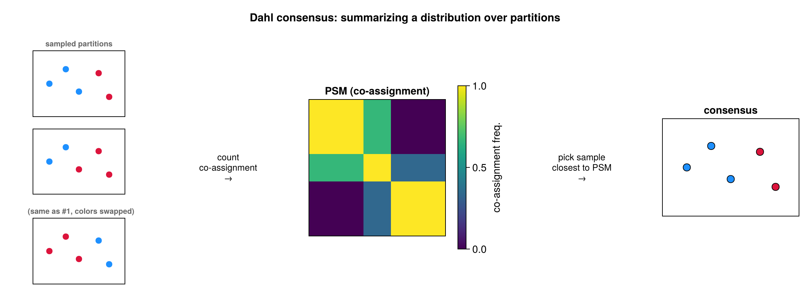
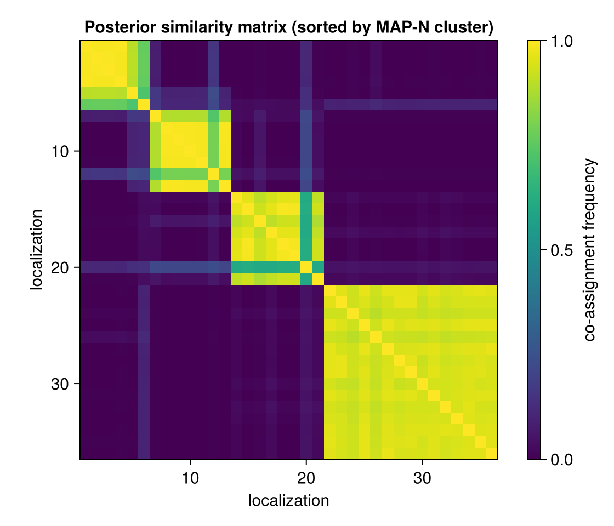

```@meta
CurrentModule = SMLMBaGoL
```

# MAP-N Estimation

The chain yields a full posterior over ``(K, \mathbf{z})``. For a point summary, the
**production path** ([`run_bagol`](@ref)) uses, per partition, Dahl consensus to fix the
count and a reference grouping, then overlap-Hungarian pooling for positions and uncertainty
(`mapn.jl`).

!!! note "General method: consensus clustering"
    The chain does not return one grouping — it returns a *distribution* over groupings, and we
    need a single representative one. You cannot simply average partitions: cluster **labels
    are arbitrary**, so "cluster 1" in one sample need not be "cluster 1" in another (label
    switching), and the average of two partitions is not even a partition. The fix is a
    label-free summary — the **posterior similarity matrix (PSM)**, the fraction of samples in
    which each *pair* of localizations lands in the same emitter; pairwise co-assignment does
    not care what the clusters are called. Dahl's method then returns the single *sampled*
    partition that best matches this average co-assignment, so the answer is always a real,
    achievable grouping rather than an artificial average. This consensus-from-co-assignment
    idea is general to clustering, not specific to BaGoL.



*Many sampled partitions are reduced to their pairwise co-assignment matrix (the PSM) — note
the first and last samples are the **same** grouping with swapped colors (label switching),
which the label-free PSM ignores. Dahl returns the sampled partition closest to the PSM: the
consensus grouping.*

## Dahl consensus

[`estimate_dahl`](@ref) chooses the visited sample whose pairwise co-assignment matrix is
closest to the **posterior similarity matrix** (PSM) in squared Frobenius distance over the
strict upper triangle:

```math
D(\mathbf{z}) = \sum_{i<j}\big(\mathbf{1}[z_i = z_j] - C_{ij}\big)^2 ,
\qquad
C_{ij} = \frac{1}{T}\sum_{t=1}^{T} \mathbf{1}\big[z_i^{(t)} = z_j^{(t)}\big],
```

where ``C_{ij}`` (from [`PSMAccumulator`](@ref)) is the empirical co-assignment frequency
over the ``T`` post-burn-in samples. This minimizes the posterior expected Binder loss
restricted to the visited partitions, and fixes ``K`` as the cluster count of the winning
sample.



*The posterior similarity matrix, localizations ordered by Dahl cluster. Bright diagonal
blocks are confident groupings; smeared off-diagonal mass is label ambiguity the reported
uncertainty must capture.*

## Overlap-Hungarian pooling

[`estimate_mapn_overlap`](@ref) restricts to samples with exactly ``K`` clusters, matches
each to the Dahl reference by **maximum localization overlap** (Hungarian on the
overlap-count cost), and pools. The emitter position is the **mean** of the matched posterior
means, and the reported covariance follows the **law of total variance**:

```math
\Sigma_{\text{emitter}}
= \underbrace{\Sigma^{\text{post}}_{\text{Dahl}}}_{\mathbb{E}[\mathrm{Var}(\theta\mid Z)]}
+ \underbrace{\mathrm{Cov}\big[\overline{\theta}^{(t)}\big]}_{\mathrm{Var}[\mathbb{E}(\theta\mid Z)]} .
```

The first term is the within-cluster analytic [posterior covariance](collapsed.md#Posterior-position-of-a-cluster);
the second adds the between-sample spread of the matched means, so allocation ambiguity
inflates the reported uncertainty rather than being hidden.


*MAP-N posterior ellipses (red, 2σ) over the localizations (faint gray, 1σ) and ground
truth (cyan). The ellipses sit on the true emitters and are far tighter than the
localization cloud.*

## Alternative estimators

Exported for direct use on stored samples (not on the default pipeline path):

- [`estimate_mapn_collapsed`](@ref) — histogram-mode ``K`` + Hungarian on positions, median pooling;
- [`estimate_mapn_psm`](@ref) — ``K`` from PSM connected components;
- [`estimate_vi_greedy`](@ref) — greedy minimization of summed Variation of Information.

All require a [`PSMAccumulator`](@ref) (and [`PartitionSamples`](@ref)) in the chain's
accumulator list.

Everything so far runs on one cluster of localizations; [Large-Dataset
Partitioning](partitioning.md) scales it to a full field of view.
