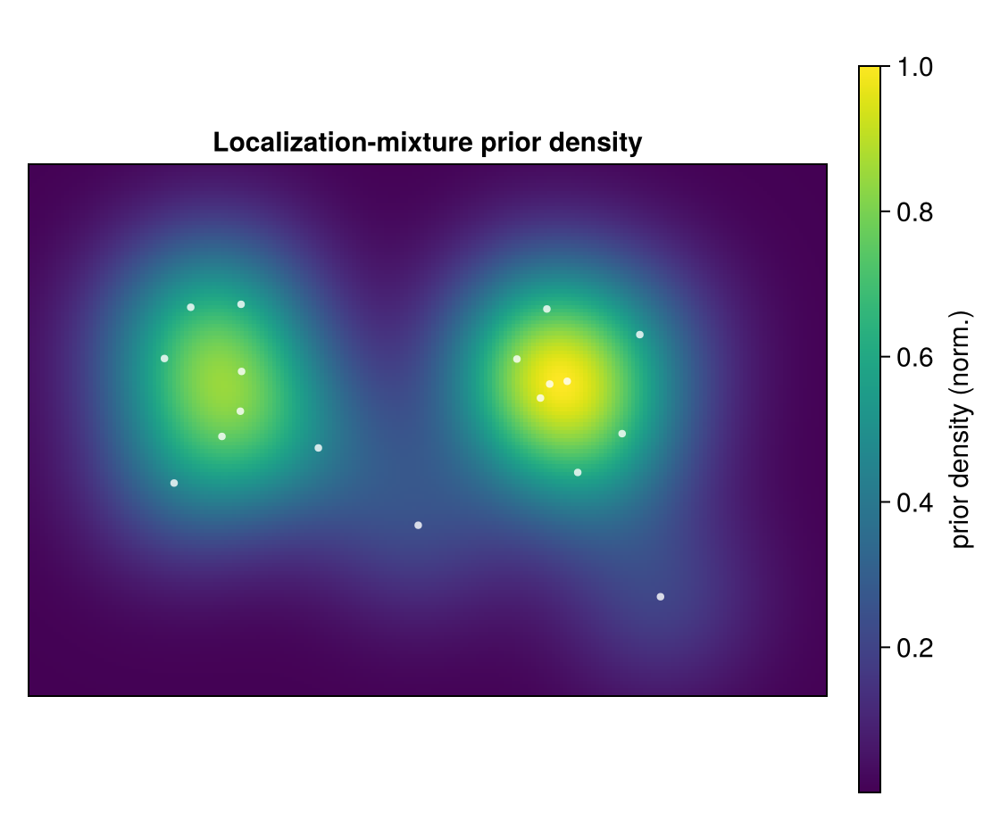
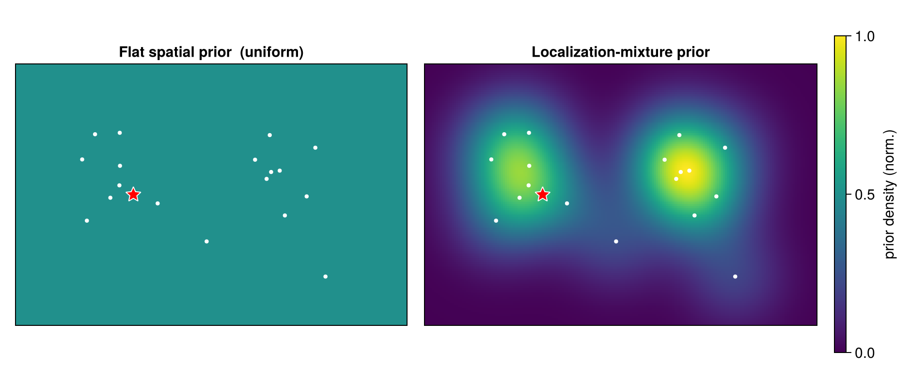

```@meta
CurrentModule = SMLMBaGoL
```

# Spatial Models & Marginal Likelihood

Integrating the emitter position ``\boldsymbol{\theta}`` out of a cluster gives its
**marginal likelihood** — the score each MCMC move evaluates. The two spatial models
(`spatial_model = :flat` or `:locmix`) share the Gaussian core and differ only in the
position-prior term.

## The Gaussian core

With ``\mathbf{x}_i \mid \boldsymbol{\theta} \sim \mathcal{N}(\boldsymbol{\theta}, \Sigma_i)``
and a flat (improper) prior on ``\boldsymbol{\theta}``, the exact Gaussian marginal is
(`cluster_stats.jl`, `log_ml_flat`):

```math
\log p_{\text{flat}}(\mathbf{x}_{1:n})
= (1-n)\tfrac{D}{2}\log(2\pi)
- \tfrac12 \sum_i \log\det\Sigma_i
- \tfrac12\big(\mathrm{quad} - \boldsymbol{\eta}^\top \Lambda^{-1}\boldsymbol{\eta}\big)
- \tfrac12 \log\det\Lambda .
```

Every term is built from the sufficient statistics of the [collapsed representation](collapsed.md).
The quadratic ``\mathrm{quad} - \boldsymbol{\eta}^\top\Lambda^{-1}\boldsymbol{\eta}`` measures
how tightly the cluster's localizations agree once their common position is fitted out: a
spatially compact cluster scores high, a diffuse one low.

This "Gaussian core" uses an **improper, infinitely-flat** prior on ``\boldsymbol{\theta}``
— it is not yet a normalized model. The two spatial models below make it proper, each by
adding one position-prior term; do not confuse this improper core with the `:flat`
**spatial model**, which is the *uniform-over-area* prior of the next section.

## Flat (uniform) spatial prior

The flat model places emitters uniformly over the region of area ``A``, adding a single
Occam factor ``-\log A`` per cluster (`cluster_stats.jl`, `log_marginal_likelihood`):

```math
\log p(\mathbf{x}_{1:n} \mid c) = \log p_{\text{flat}}(\mathbf{x}_{1:n}) - \log A .
```

This ``-\log A`` is what penalizes adding emitters under the flat model — each new cluster
pays one factor of the area.

## Localization-mixture prior (`:locmix`, the default)

The default model replaces the uniform prior with a **localization-mixture** prior that
concentrates emitter-position mass where localizations are dense:

```math
P(\boldsymbol{\theta}) = \frac{1}{N}\sum_{j=1}^{N} \mathcal{N}(\boldsymbol{\theta};\ \mathbf{x}_j,\ \Sigma_j).
```

The marginal then adds ``\log P_{\text{locmix}}`` in place of ``-\log A``. **Importantly, the
live sampler evaluates this term as a plug-in: it takes ``\log P_{\text{locmix}}`` at the
single point ``\hat{\boldsymbol{\theta}} = \Lambda^{-1}\boldsymbol{\eta}`` (the cluster
posterior mean), not as the full integral over ``\boldsymbol{\theta}``** — a saddle-point
approximation chosen for speed:

```math
\log p_{\text{locmix}}(\mathbf{x}_{1:n} \mid c)
= \log p_{\text{flat}}(\mathbf{x}_{1:n}) + \log P_{\text{locmix}}(\hat{\boldsymbol{\theta}}),
\qquad \hat{\boldsymbol{\theta}} = \Lambda^{-1}\boldsymbol{\eta}.
```



*The localization-mixture prior density ``P_{\text{locmix}}(\boldsymbol\theta)`` over a
localization field — prior mass pools on the data. The flat prior would be a constant sheet
by comparison.*

!!! note "Exact integral vs. the production path"
    ``\log P_{\text{locmix}}`` is precomputed on a grid (`log_marginal_likelihood_locmix`).
    The plug-in is exact only in the limit where the prior is flat over the posterior width of
    ``\boldsymbol\theta``. The exact mixture integral (`log_ml_locmix`) is implemented and used
    by the diagnostics, but the grid plug-in is the production path.

## Predictive probability

The [Gibbs sweep](moves.md) needs the predictive for adding one localization
``\mathbf{x}_*`` to a cluster ([`ClusterStats`](@ref), `log_predictive`):

```math
\log\mathrm{pred}(\mathbf{x}_* \mid c) =
\begin{cases}
\text{(prior at } \mathbf{x}_* \text{)}, & n_c = 0,\\[2pt]
\log p(c \cup \mathbf{x}_*) - \log p(c), & n_c > 0.
\end{cases}
```

Under the flat model the ``-\log A`` terms cancel for ``n_c > 0``, so the predictive is
area-independent except when seeding an empty cluster; under locmix the prior terms do not
cancel (they are evaluated at the shifted posterior mean).



*The flat prior (left, uniform) versus the localization-mixture prior (right, concentrated
on the localizations), with the same candidate emitter position (red star) marked in both —
locmix rewards groupings that sit on dense data.*

Next: the [priors](priors.md) that weigh these likelihood scores — on the allocation, the
blink counts, and the emitter number ``K``.
