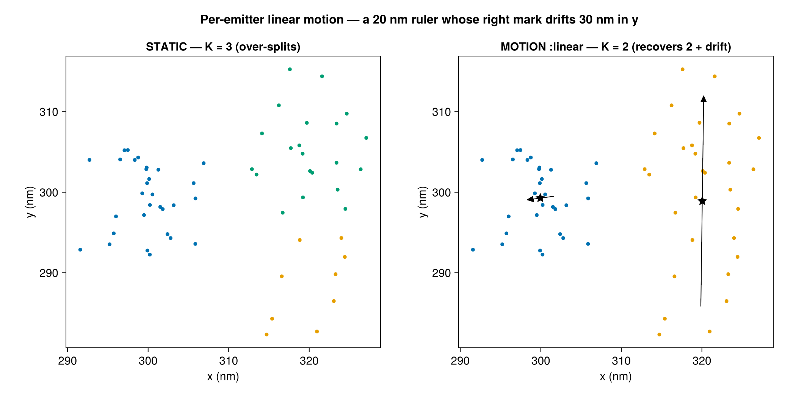
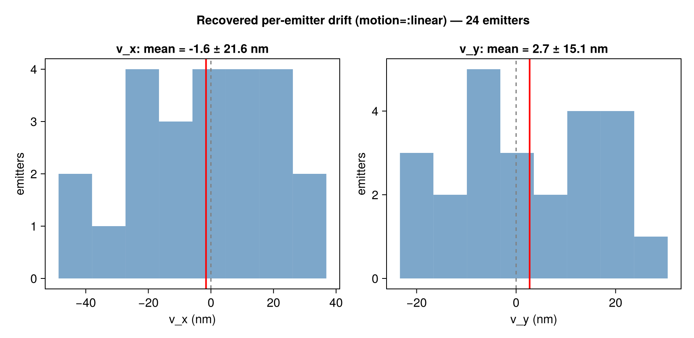

```@meta
CurrentModule = SMLMBaGoL
```

# Per-Emitter Linear Motion

By default BaGoL assumes each emitter is **static** — its blinks scatter around one
fixed position. But an emitter can *move* during the acquisition: a residual drift the
global drift-correction missed, or a genuinely mobile molecule in a live cell. When that
happens, a single emitter's blinks spread along a track, and the static model — seeing
"too much" spread for the reported precision — **over-splits** one emitter into several.

The optional linear-motion model (`motion=:linear`, default off) lets each emitter drift
linearly in time and **integrates the motion out in closed form**, so the grouping search
stays a discrete collapsed sampler. It recovers the moving emitter as one object and
reports the recovered drift.



*A 20 nm ruler whose right mark drifts 30 nm in y. The static model (left) over-splits the
drifting mark into several emitters; `motion=:linear` (right) recovers the two marks 20 nm
apart, each annotated with its recovered end-to-end drift vector — large for the moving
mark, ≈0 for the static one.*

## The model

Each emitter `k` has a position at the reference time, `μ_k`, and a velocity `v_k`. Its
position at the time of localization `i` is

```math
\boldsymbol{\theta}_k(t_i) = \boldsymbol{\mu}_k + \mathbf{v}_k\, \delta_i ,
\qquad
\delta_i = \frac{\mathrm{frame}_i - t_0}{\mathrm{span}} \in \left[-\tfrac12, \tfrac12\right],
```

with a **global** time reference `t_0` (mid-acquisition) and `span` (the frame range), so
`μ_k` means "position at mid-acquisition" (comparable across emitters) and `v_k` is the
**end-to-end displacement** over the whole acquisition. Localization `i` is then

```math
\mathbf{y}_i \sim \mathcal{N}\!\big(\boldsymbol{\mu}_{z_i} + \mathbf{v}_{z_i}\delta_i,\ \Sigma_i\big).
```

The latent ``\boldsymbol{\beta}_k = [\boldsymbol{\mu}_k;\ \mathbf{v}_k]`` is given a flat prior on
``\boldsymbol{\mu}`` (as the static model) and a **zero-mean Gaussian prior** on the velocity,
``\mathbf{v}_k \sim \mathcal{N}(\mathbf 0,\ \Sigma_v)`` with precision ``\Lambda_v = \Sigma_v^{-1}``.
The prior scale is `motion_sigma` — the per-axis end-to-end drift SD in μm.

## Integrating out the motion

Per cluster this is a **Bayesian linear regression of position on time**: with design
``X_i = [\,I\ \ \delta_i I\,]`` the model is ``\mathbf y_i = X_i\boldsymbol\beta + \boldsymbol\varepsilon_i``,
``\boldsymbol\varepsilon_i\sim\mathcal N(0,\Sigma_i)``, which is linear-Gaussian — so
``\boldsymbol\beta`` integrates out exactly. The sufficient statistics extend the static
``\{A=\sum_i\Lambda_i,\ \boldsymbol\eta=\sum_i\Lambda_i\mathbf y_i,\ q,\ n\}`` with the
time-weighted blocks

```math
\mathrm{Bm} = \sum_i \delta_i \Lambda_i, \quad
C = \sum_i \delta_i^2 \Lambda_i, \quad
\boldsymbol\eta_\delta = \sum_i \delta_i \Lambda_i \mathbf y_i ,
```

all still ``O(1)`` to add/remove. Via the Schur complement the cluster marginal is the
**static marginal plus a small velocity correction**:

```math
\log p_{\text{motion}}(\mathbf y_c) =
\log p_{\text{static}}(\mathbf y_c)
\;+\; \tfrac12\, \mathbf r^\top S^{-1}\mathbf r
\;-\; \tfrac12\log|S|
\;+\; \tfrac12\log|\Lambda_v| ,
```

```math
S = C + \Lambda_v - \mathrm{Bm}^\top A^{-1}\mathrm{Bm}, \qquad
\mathbf r = \boldsymbol\eta_\delta - \mathrm{Bm}^\top A^{-1}\boldsymbol\eta .
```

This reduces **exactly** to the static marginal as the velocity prior tightens
(``\sigma_v\to 0``, i.e. ``\Lambda_v\to\infty``) and at ``n=1`` — so motion is a strict,
opt-in generalization, not a different model. A proper ``\Lambda_v`` keeps ``S`` positive
definite even when blinks span a short time window or a cluster has one localization.

The whole construction is **dimension-parametric**: ``A``, ``\mathrm{Bm}``, ``C``,
``\Lambda_v`` are ``D\times D`` and ``\boldsymbol\beta\in\mathbb R^{2D}``. The marginal and
cluster statistics are verified in both 2D (`Emitter2DFit`) and 3D (`Emitter3DFit`) via the
feature-dimension dispatch, so the **model** is dimension-agnostic. The full `run_bagol`
output pipeline (partitioning + MAP-N) is 2D — a general `run_bagol` limitation independent
of motion; for 3D motion use `run_collapsed_chain` directly.

## Recovered velocity output

When `motion=:linear`, each recovered emitter carries a posterior velocity
``\hat{\mathbf v}_k`` (and position ``\hat{\boldsymbol\mu}_k`` at the reference time) from
``\hat{\boldsymbol\beta} = B^{-1}\mathbf b``. These are summarized in the diagnostics:

```julia
result, diag = run_bagol(smld; motion=:linear, motion_sigma=0.002)
diag.motion.velocities          # N×D matrix of recovered v̂ per emitter (μm)
diag.motion.velocity_var        # N×D per-axis velocity posterior variance Σv (μm²)
diag.motion.n                   # per-emitter member count
diag.motion.axis_mean           # per-axis mean drift, raw (μm)
diag.motion.axis_mean_weighted  # per-axis mean, precision-weighted by 1/Σv (μm)
```

**Precision-weighting matters at scale.** A few-localization emitter has weak time leverage,
so its velocity posterior *shrinks toward the zero-mean prior* (large `Σv`). On crowded data
the many low-`n` emitters then dominate a raw histogram and wash it out toward the
isotropic prior. So `write_report` reports both the raw and the **precision-weighted**
(``1/\Sigma_v``) drift mean ± std, and `plot_report` writes a **precision-weighted**
``v_x`` / ``v_y`` (``/v_z``) histogram (**`motion_velocities.png`**) — down-weighting
prior-shrunk velocities so the QC view reflects the well-determined emitters. `velocity_var`
and `n` are exposed so downstream code can gate (`n ≥ N`) or weight however it likes.



*Recovered end-to-end drift (`v_x`, `v_y`) across a field of rulers, with the mean (red)
marked. The spread shows how much residual motion the run absorbed per axis.*

## When to use it — and the risk

**Use it for:** live-cell or mobile emitters; long acquisitions where an emitter moves
appreciably; data where the static model visibly over-splits a single emitter along a
time-ordered track. It needs per-localization `frame` values spanning the acquisition
(frame-connected data) — without temporal leverage the model is a no-op.

**Leave it off (default) for:** fixed-cell dSTORM/PALM after good global drift correction
(static emitters), where the term is pure overfitting risk.

**The risk** (why it is opt-in and default off): a *loose* velocity prior can **merge**
two distinct static emitters that are active in different time windows into one
"moving" emitter — a line through time bridging spatially-separated clusters the static
model would correctly resolve. Keep `motion_sigma` to the genuinely-expected drift; the
default `0.002` (2 nm) is deliberately tight. If residual **global** drift is the concern,
fix it upstream — per-emitter slopes would each absorb the shared trend and *mask* it.

```julia
# Opt-in via the kwarg or the config
run_bagol(smld; motion=:linear, motion_sigma=0.002)
run_bagol(smld, BaGoLConfig(motion=:linear, motion_sigma=0.002))
```
