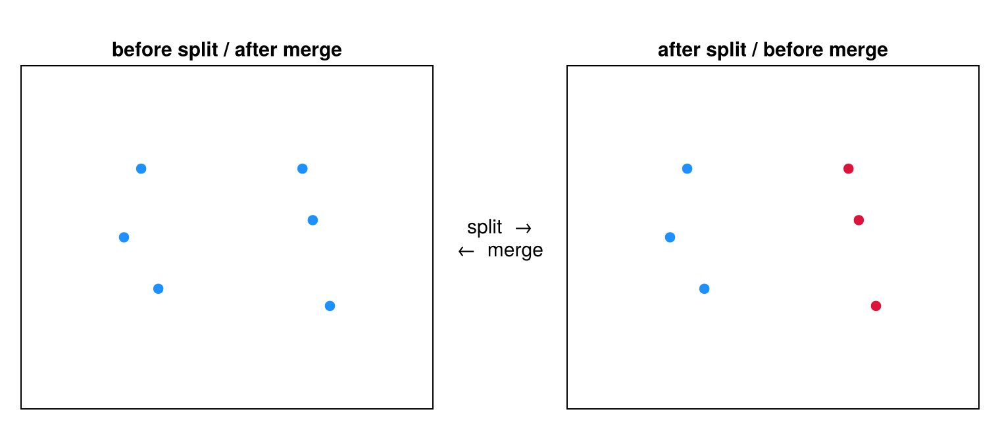
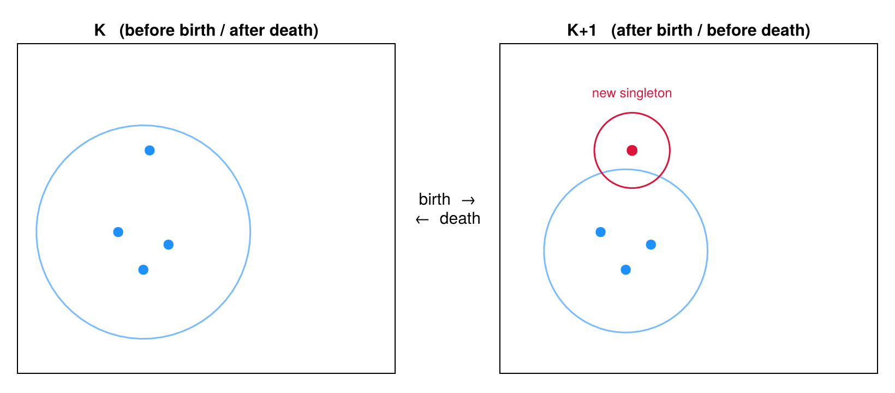
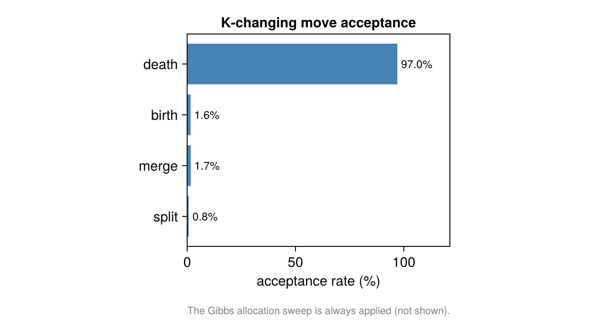

```@meta
CurrentModule = SMLMBaGoL
```

# The Sampler: Moves

[`run_collapsed_chain`](@ref) runs a collapsed Gibbs / reversible-jump MCMC chain over the
allocation vector. Because the state is discrete, every move is a re-partitioning and there
is no Jacobian term anywhere in the acceptance ratios.

## Move schedule

Each iteration draws one ``r \sim U(0,1)`` and picks a move (`collapsed_sampler.jl`):

| Branch | Condition | Probability | Work |
|---|---|---|---|
| Gibbs allocation sweep | ``r < 0.50`` | 0.50 | one full sweep of all ``N`` locs (``K`` fixed) |
| Split / merge | ``0.50 \le r < 0.75`` | 0.25 | one RJMCMC ``\|\Delta K\| = 1`` attempt |
| Birth / death | ``r \ge 0.75`` | 0.25 | `n_bd_substeps` independent attempts |

## Gibbs allocation sweep (``K`` fixed)

This is a **Metropolized-Gibbs** move, not direct categorical Gibbs. For each localization
``i`` (current cluster ``k_0``), the proposal uses the **predictive only**, and the DM
partition factor enters as a Metropolis correction (`collapsed_moves.jl`):

```math
q(z_i = k) \;=\; \frac{\exp\big(\mathrm{spatial\_pred}(c_{-i,k},\, \mathbf{x}_i)\big)}
                       {\sum_{k'} \exp\big(\mathrm{spatial\_pred}(c_{-i,k'},\, \mathbf{x}_i)\big)},
\qquad
\alpha = \min\!\left(1,\ \frac{n_{-i,k^*} + \gamma}{n_{-i,k_0} + \gamma}\right).
```

The predictive factors cancel in the acceptance ratio, leaving exactly the DM count factor —
so the sweep's stationary conditional is the collapsed full conditional

```math
P(z_i = k \mid \text{rest}) \;\propto\; (n_{-i,k} + \gamma)\ \cdot\ \mathrm{predictive}(\mathbf{x}_i \mid c_k).
```

For `:decoupled` / `:categorical` the correction is ``1``, reducing the sweep to exact
predictive-only Gibbs.

## Split / merge (RJMCMC, ``|\Delta K| = 1``)

A boundary-aware coin flip proposes a split (``K \to K+1``) or merge (``K \to K-1``). A
split picks a cluster uniformly, seeds two new clusters from two random members, then
allocates the rest by **Jain–Neal restricted Gibbs scans** (`n_restricted_scans`, default 5:
a launch, ``n-1`` intermediate sweeps, and one final density-tracked sweep). A merge is the
deterministic reverse, with the split allocation density evaluated for the ratio.



*A split turns one cluster of localizations (left) into two (right), seeded at two members
and filled by restricted Gibbs; the reverse direction is the merge.*

## Birth / death

A birth detaches one localization from a multi-member cluster into a brand-new singleton; a
death reabsorbs a singleton into an existing cluster chosen by predictive weight. The
move-type selection probabilities are folded directly into the proposal densities, so
birth/death carries **no separate move-type term** and (unlike split/merge) its reverse
densities are deterministic.



*A birth detaches one localization from a cluster into its own singleton emitter
(``K \to K+1``); death is the reverse absorb (``K \to K-1``).*

## Acceptance ratios

Split/merge and birth/death are Metropolis–Hastings accepted on a sum of log-terms, in this
exact additive order (`collapsed_moves.jl`):

```math
\log\alpha = \Delta_{\text{spatial}} + \Delta_{\text{partition}}
           + \Delta_{\text{proposal}} + \Delta_{\text{count}}
           + \Delta_{K\text{-prior}} + \Delta_{\text{move type}},
```

(birth/death omits ``\Delta_{\text{move type}}``), where

- ``\Delta_{\text{spatial}}`` — change in summed cluster [marginal likelihood](marginal.md);
- ``\Delta_{\text{partition}}`` — change in the [DM partition prior](priors.md#Allocation:-the-Dirichlet-Multinomial-partition-prior) (``0`` for `:decoupled`);
- ``\Delta_{\text{proposal}}`` — reverse/forward proposal-density ratio (cluster/pair selection and the restricted-Gibbs transition density);
- ``\Delta_{\text{count}}`` — the [NegBin count-model](priors.md#Count:-the-negative-binomial-blink-model) change;
- ``\Delta_{K\text{-prior}}`` — the Poisson ``K``-prior change, **nonzero only under `spatial_model = :flat`**.

Acceptance is uniformly ``\log\alpha \ge 0`` or ``\log u < \log\alpha`` with ``u \sim U(0,1)``;
a rejected move is rolled back exactly.



*Per-move acceptance rates from a real run — the ``K``-changing moves (split, merge, birth,
death). The Gibbs allocation sweep is always applied and not shown. A quick read on whether
the chain is mixing across ``K``.*
