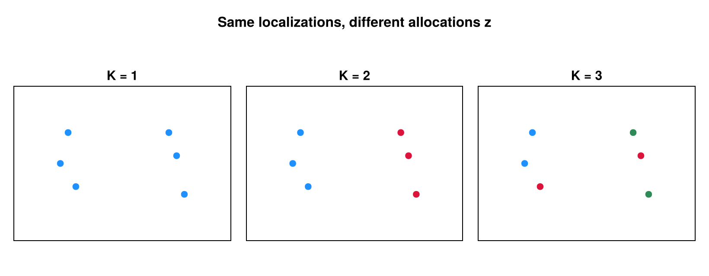
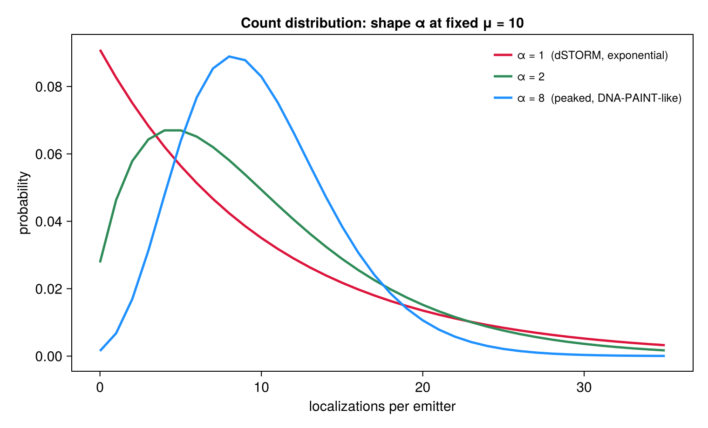

```@meta
CurrentModule = SMLMBaGoL
```

# Priors: Allocation, Count & K

Three priors regularize the partition. They are selectable through `allocation_model`,
the count model, and `k_prior` (see the [User Guide](../guide.md#Advanced:-model-choices)).

## Allocation: the Dirichlet-Multinomial partition prior

`allocation_model = :dm` (default) places a Dirichlet–Multinomial (Pólya) prior on the
**labeled** allocation ``\mathbf{z}`` with ``K`` clusters of sizes ``n_1, \dots, n_K`` and
concentration ``\gamma`` (`collapsed_moves.jl`, `_log_dm_partition`):

```math
\log P(\mathbf{z} \mid K) =
\log\Gamma(K\gamma) - K\log\Gamma(\gamma) - \log\Gamma(N + K\gamma)
+ \sum_{k=1}^{K} \log\Gamma(n_k + \gamma).
```

This is the Pólya-urn probability of a specific labeled assignment (it omits the
multinomial coefficient that the unordered size-vector would carry — correct, because the
sampler state *is* the labeled vector). The ``\Gamma(K\gamma)/\Gamma(N+K\gamma)`` normalizer
depends on ``K``, so the DM prior contributes to ``K``-changing moves.

By default ``\gamma = \alpha`` (the count-distribution `shape`), tying allocation
concentration to the count model; passing `gamma` fixes it independently. The alternatives:
`:decoupled` drops this term entirely (spatial likelihood alone drives ``\mathbf{z}``), and
`:categorical` uses ``P(\mathbf{z}\mid K) = K^{-N}``.



*The same six localizations under three candidate allocations (``K = 1, 2, 3``) — the discrete
choices the DM partition prior scores. Larger ``\gamma`` favors more, smaller clusters.*

## Count: the negative-binomial blink model

Each emitter's blink count is negative-binomial, and the total ``N = \sum_k n_k`` over ``K``
emitters is its ``K``-fold convolution (`collapsed_moves.jl`, `_log_count_posterior`):

```math
n_k \mid \mu, \alpha \;\sim\; \mathrm{NegBin}\!\Big(r = \alpha,\ p = \tfrac{\alpha}{\alpha + \mu}\Big),
\qquad
N \mid K \;\sim\; \mathrm{NegBin}\!\Big(r = K\alpha,\ p = \tfrac{\alpha}{\alpha + \mu}\Big),
```

with ``\mathbb{E}[n_k] = \mu`` and shape ``\alpha = \texttt{shape}``. This term is **always
active**; it enters every ``K``-changing move as
``\Delta_{\text{count}} = \log P(N \mid K') - \log P(N \mid K)`` and is the main regularizer
of ``K`` under the default `:locmix` model.



*The per-emitter count distribution ``\mathrm{NegBin}(\alpha, \alpha/(\alpha+\mu))`` at fixed
mean ``\mu = 10`` for several shapes: ``\alpha = 1`` is the dSTORM exponential (monotone
decreasing), while larger ``\alpha`` gives a peaked, DNA-PAINT-like shape. The shape is itself
learned — see [Hierarchical Learning](hierarchical.md).*

!!! note "Negative-binomial, not Gamma"
    The shorthand ``P(N\mid K) = \mathrm{Gamma}(N; K\alpha, \mu/\alpha)`` describes the
    continuous rate layer of the Gamma–Poisson mixture. The implementation evaluates the
    exact discrete negative-binomial; the two share the mean ``K\mu`` but the NegBin carries
    the extra Poisson sampling variance.

## The emitter-count (``K``) prior

`k_prior = :auto` (default), `:poisson`, or `:none`. Under the default `:locmix` spatial
model there is **no separate ``K`` prior** — the count model plus the DM prior already
regularize ``K``. Under `spatial_model = :flat`, an area-cancelled Poisson prior
``K \sim \mathrm{Poisson}(\rho A)`` is added (`priors.jl`, `log_prior_k_poisson`):

```math
\log P(K) = -\rho A + K\log\rho - \log K! \quad (K \ge 1).
```

The ``A^{-K}`` from the uniform per-emitter location priors cancels the ``A^K`` from the
Poisson rate, leaving an area-independent factor; the per-cluster ``-\log A`` is supplied
separately by the [flat marginal likelihood](marginal.md#Flat-(uniform)-spatial-prior). The
density ``\rho`` is itself learned (see [Hierarchical Learning](hierarchical.md)).
`k_prior = :poisson` is valid **only** with `spatial_model = :flat`.

These three priors are exactly the prior terms that appear in the move acceptance ratio
assembled on [The Sampler: Moves](moves.md).
