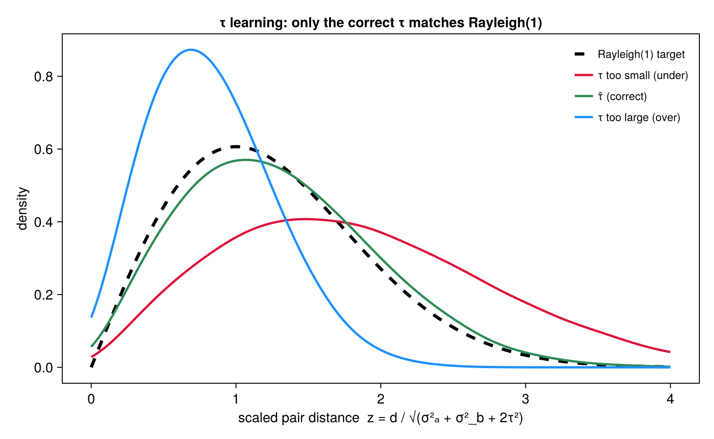
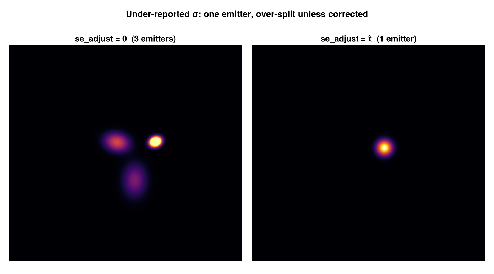

```@meta
CurrentModule = SMLMBaGoL
```

# Uncertainty Correction

BaGoL's accuracy rests on the reported localization uncertainties ``\sigma`` being correct.
When they are underestimated by a common amount ``\tau``, within-emitter localizations look
*too* spread out for their error bars, and BaGoL over-splits — one true emitter becomes
several. [`estimate_se_adjust`](@ref) recovers ``\tau`` from the data and
[`apply_se_adjust`](@ref) folds it in (`se_estimate.jl`).

## The Rayleigh statistic

At the true ``\tau`` and the correct grouping, the **scaled** separations of within-emitter
localization pairs follow a Rayleigh(1) law. For a within-group pair with separation ``d``,

```math
z = \frac{d}{\sqrt{\sigma_a^2 + \sigma_b^2 + 2\tau^2}} \;\sim\; \mathrm{Rayleigh}(1),
\qquad F(z) = 1 - e^{-z^2/2}.
```

The finder estimates ``\tau`` by minimizing the **Kolmogorov–Smirnov** distance between the
empirical CDF of the ``z`` and this reference:

```math
\hat{\tau} = \arg\min_{\tau}\ \max_i \left| \frac{i}{n} - \big(1 - e^{-z_{(i)}^2/2}\big) \right|.
```



*The distribution of scaled within-emitter pair distances ``z`` at three values of ``\tau``:
too small (``\tau = 0``, shifted right — localizations look over-spread), correct
(``\hat\tau``, matching the Rayleigh(1) target), and too large (shifted left — over-merged).
The estimator picks the ``\tau`` whose empirical distribution best matches Rayleigh(1), via
the Kolmogorov–Smirnov criterion above.*

## Over-merge descent

Grouping depends on ``\tau`` and ``\tau`` depends on the grouping, so the finder alternates
an EM-style loop:

1. **E-step** — regroup the data with a temporary BaGoL run at the current ``\tau`` (using
   BaGoL's own Dahl-consensus labels);
2. **M-step** — find the KS-minimizing ``\tau`` on that frozen grouping (right-biased, to
   preserve same-emitter spread),

descending from above until ``\tau`` is self-consistent. A spatial-block bootstrap provides a
95% confidence interval. The estimator is **isotropic**: it uses one per-localization
uncertainty (the reported ``\sigma_x``) and a single scalar ``\tau``, so it is intended for
data with roughly isotropic localization precision.

## Applying the correction

[`apply_se_adjust`](@ref) inflates each localization's uncertainty in quadrature, per axis:

```math
\sigma_x' = \sqrt{\sigma_x^2 + \tau_x^2}, \qquad \sigma_y' = \sqrt{\sigma_y^2 + \tau_y^2},
```

after which the corrected ``\sigma'`` propagates into every precision ``\Lambda_i`` of the
[collapsed representation](collapsed.md). Set `se_adjust=:auto` to run the finder and apply
its result, or pass a known number directly. The correction self-guards against
double-applying: data already corrected upstream (metadata `sigma_corrected = true`) is
skipped, and the finder refuses to run on already-corrected data.



*A single emitter whose reported σ is underestimated. With `se_adjust=0` BaGoL over-splits it
into three spurious emitters (left); with the estimated ``\hat\tau`` folded in it recovers the
one true emitter (right) — the visible failure mode the correction removes.*
