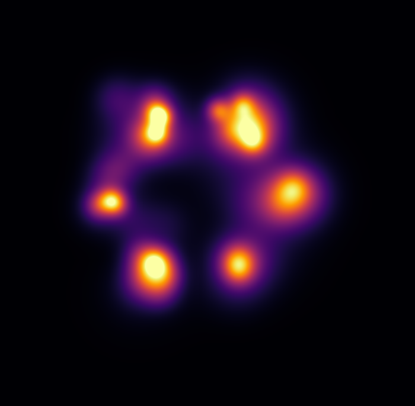
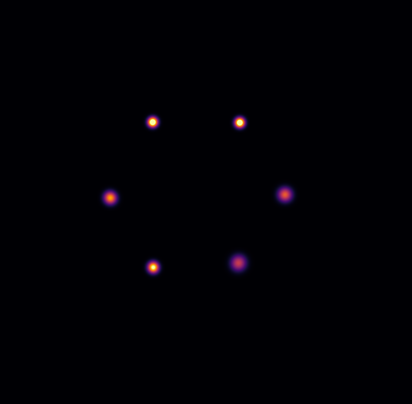
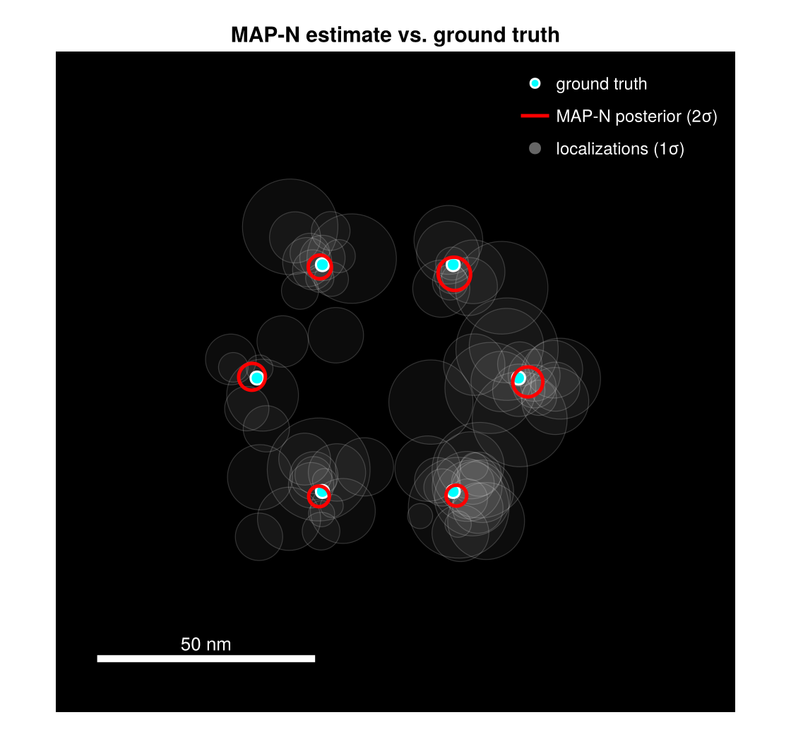
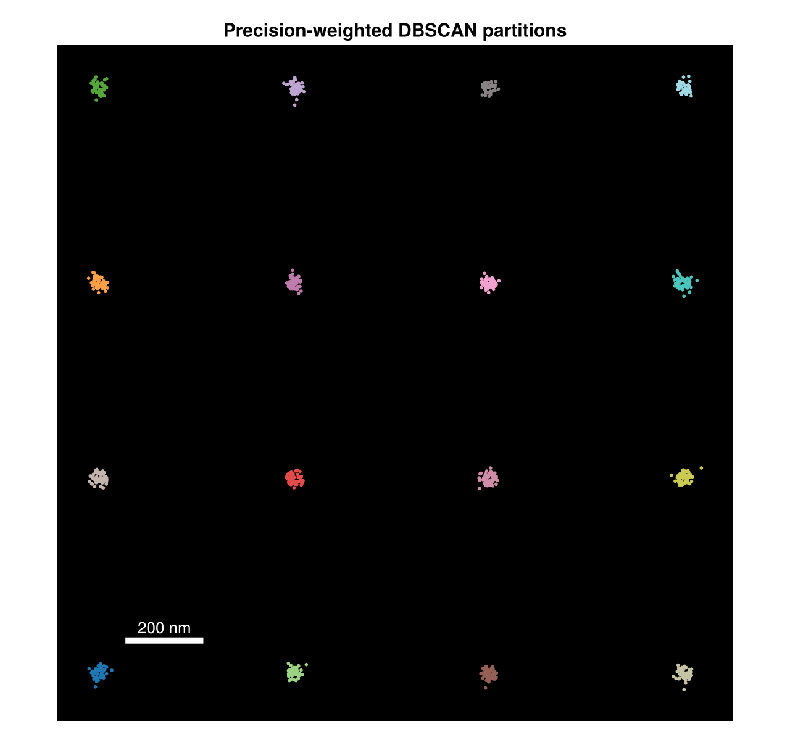

```@meta
CurrentModule = SMLMBaGoL
```

# Results Gallery

End-to-end results on simulated data, produced by the standard pipeline:
`simulate_nmer` → [`run_bagol`](@ref) → [`compute_report`](@ref) →
[`plot_report`](@ref) / [`render_report`](@ref). All figures on this page are regenerated by
`docs/make_figures.jl` (run under the `examples` project) so they stay in sync with the code.

## The super-resolution gain

A single N-mer of emitters, each blinking many times. The raw localizations are a blur; BaGoL
groups them back into the individual emitters.




*Gaussian render of the raw localizations (top) beside the BaGoL MAP-N result (bottom), same
scale and field of view, for a simulated hexamer of known geometry.*

## MAP-N against ground truth



*Localizations (faint gray), simulated ground-truth positions (cyan), and BaGoL MAP-N
emitters with posterior ellipses (red). The ellipses sit on the true emitters at a precision
the raw data cannot reach.*

## Posterior image

Beyond a point estimate, BaGoL produces a Rao-Blackwellized posterior image — a
super-resolution reconstruction that integrates over the whole chain rather than a single
grouping.


*The Rao-Blackwellized posterior image for the same hexamer: emitter density with
uncertainty baked in, no thresholding.*

## Diagnostics at a glance


*Two of the [`plot_report`](@ref) diagnostics — the convergence traces and the learned vs.
true count distribution — the standard read for assessing a run.*

## Large field: partitioning



*A grid of N-mers across a wide field, colored by [partition](math/partitioning.md). BaGoL
runs each partition in parallel and deduplicates the boundaries.*

## Reproducing these figures

```bash
julia --threads=auto --project=examples docs/make_figures.jl
```

The script writes PNGs into `docs/src/assets/`. See the [examples directory](https://github.com/JuliaSMLM/SMLMBaGoL.jl/tree/main/examples)
for the full, parameterized workflow scripts these figures are built from.
