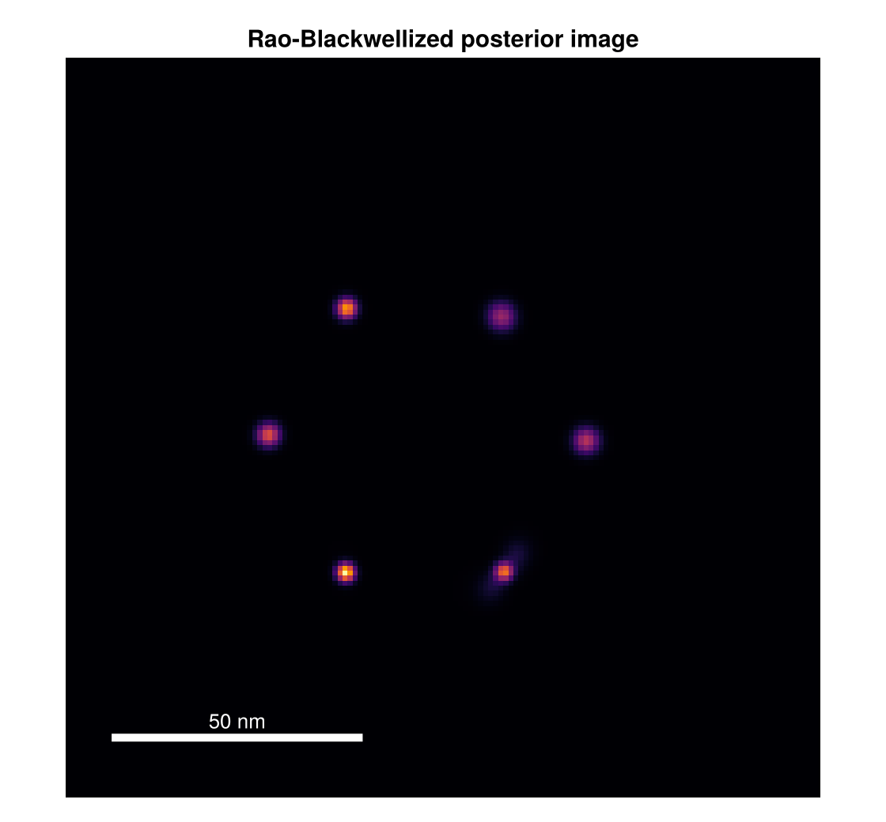
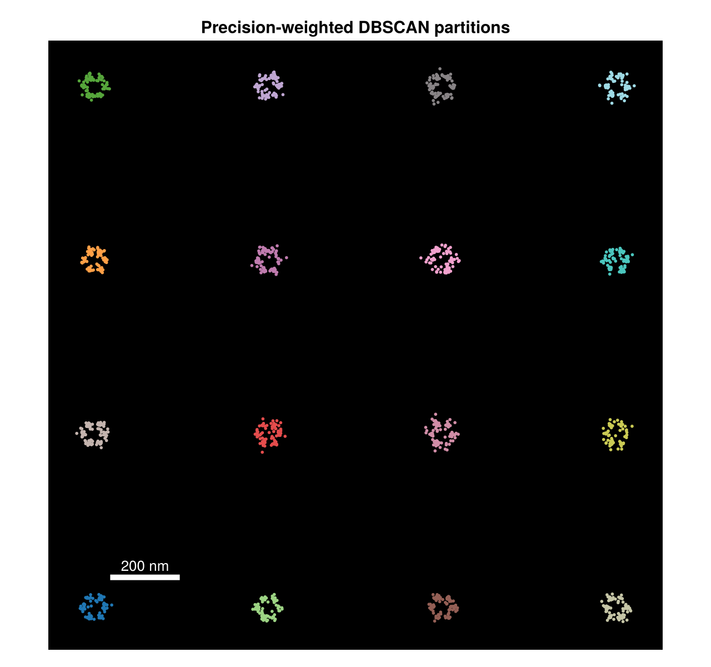

```@meta
CurrentModule = SMLMBaGoL
```

# Results Gallery

End-to-end results on simulated data, produced by the standard pipeline:
`simulate_nmer` → [`run_bagol`](@ref) → [`compute_report`](@ref) →
[`plot_report`](@ref) / [`render_report`](@ref). All figures here are regenerated by
`docs/make_figures.jl` (run under the `examples` project) so they stay in sync with the code.

## The super-resolution gain

A simulated hexamer of emitters, each blinking many times. The raw localizations are an
unresolved blur; BaGoL groups them back into the six individual emitters.


*Gaussian render of the raw localizations (left) beside the BaGoL MAP-N result (right), same
scale and field of view.*

The numbers for this run:

| Quantity | Value |
|---|---|
| True emitters | 6 |
| MAP-N emitters | 6 |
| Posterior ``P(K = 6)`` | 0.62 |
| Median raw localization σ | 5.9 nm |
| Median MAP-N emitter σ | 1.4 nm |

BaGoL recovers the correct emitter count and tightens the per-emitter position uncertainty
roughly fourfold (5.9 nm → 1.4 nm) by pooling each emitter's localizations.

## MAP-N against ground truth


*Localizations (faint gray), simulated ground-truth positions (cyan), and BaGoL MAP-N
emitters with posterior ellipses (red, 2σ). The ellipses sit on the true emitters at a
precision the raw data cannot reach.*

## Posterior image

Beyond a point estimate, BaGoL produces a Rao-Blackwellized posterior image — a
super-resolution reconstruction that integrates over the whole chain rather than a single
grouping.



*The posterior image for the same hexamer: emitter density with uncertainty baked in, no
thresholding.*

## Diagnostics at a glance


*Two of the [`plot_report`](@ref) diagnostics — the convergence traces and the learned vs.
true count distribution. The [User Guide](guide.md#Is-the-run-sane?) explains how to read
these to tell whether a run is sane.*

## Large field: partitioning



*A grid of N-mers across a wide field, colored by [partition](math/partitioning.md). BaGoL
runs each partition in parallel and deduplicates the boundaries.*

## Reproducing these figures

```bash
julia --threads=auto --project=examples docs/make_figures.jl
```

The script writes PNGs into `docs/src/assets/`. The same outputs are produced in a normal
workflow by [`plot_report`](@ref) (the diagnostic plots) and [`render_report`](@ref) (the
Gaussian / ellipse renders) — see [Standard reports](guide.md#Standard-reports) in the User
Guide. The [examples directory](https://github.com/JuliaSMLM/SMLMBaGoL.jl/tree/main/examples)
has the full, parameterized workflow scripts these figures are built from.
